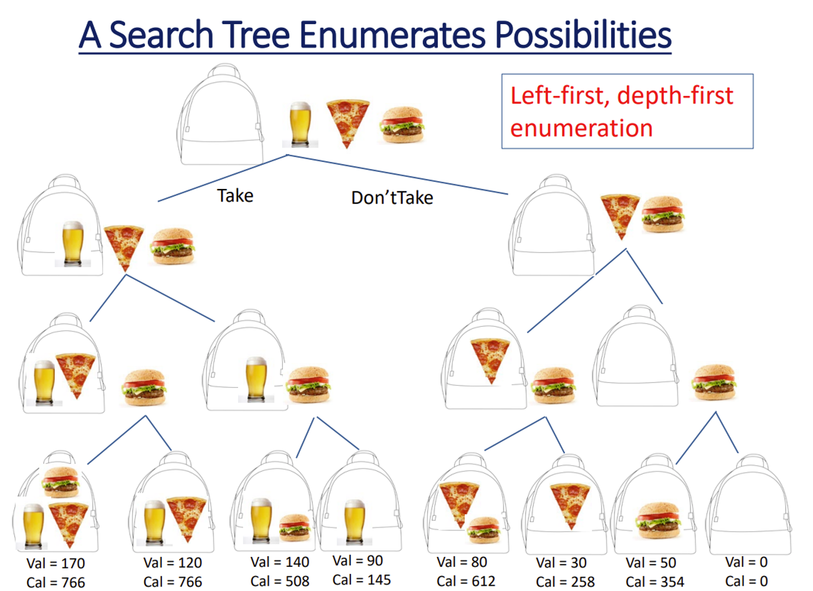
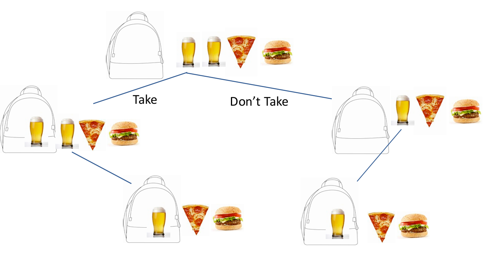
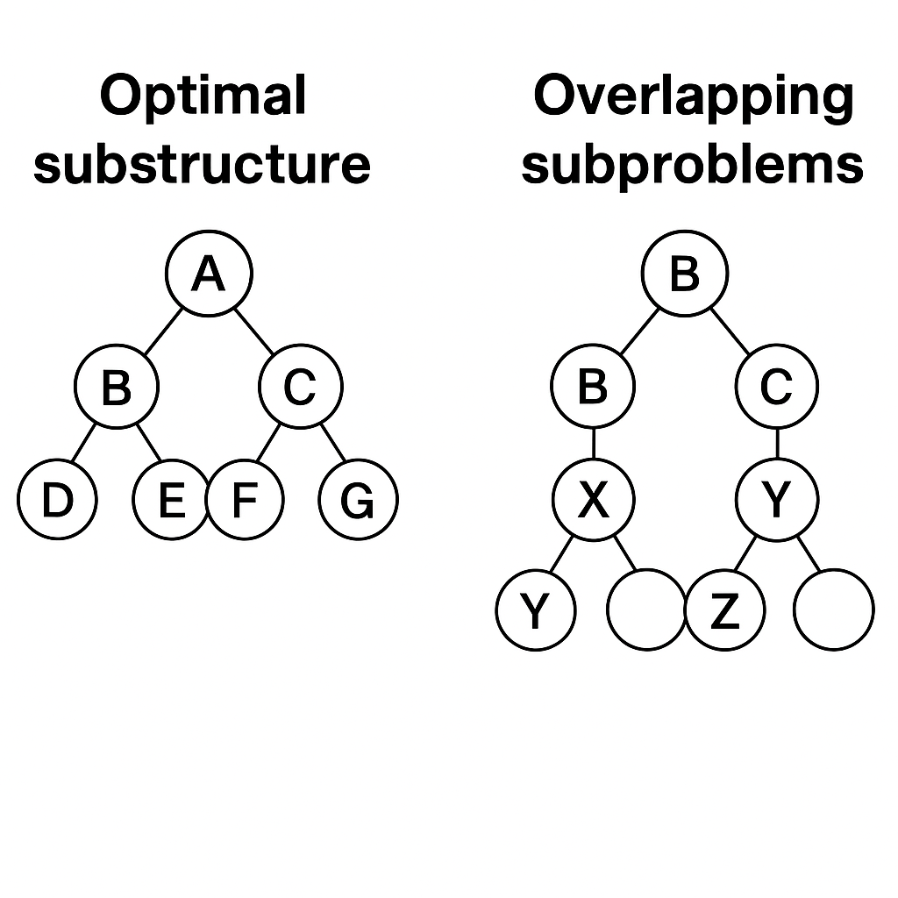

# Introduction to Dynamic Programming

## 📚 Optimization Problems: Making the Best Choice

In many real-life scenarios, we want to make the *best* decision — whether it's choosing which food to buy with limited calories or selecting the most valuable items to pack into a suitcase with weight restrictions.

This kind of problem is called an **optimization problem**, and they often have one key feature:  
> We want to **maximize** or **minimize** something (like value, calories, or cost), under certain constraints.

---

## 🛠 Brute Force: Try Everything (Literally)

A **brute-force algorithm** tries *every possible combination* of choices to find the best one. For example:

> 🍺 + 🍕 + 🍔 = 1 combo  
> 🍺 + 🍕 = another combo  
> 🍺 alone = another combo  
> ... and so on.

This works, but it's painfully slow when the number of items increases.

- If we have **n** items, brute force checks up to **2ⁿ** combinations.
- That means for 4 items, it checks 16; for 8, it checks 256 — and it explodes from there.

---

## 🌳 Visualizing Brute Force with a Decision Tree

We can draw out the brute-force approach as a **decision tree**:

- Each level of the tree represents a choice: _take_ or _don’t take_ an item.
- Each path down the tree is one combination of decisions.

### Example:

You can quickly see that many branches share subproblems — we're solving the same smaller problems again and again.

---

## 💡 Enter Dynamic Programming

To fix the inefficiency, we use **Dynamic Programming (DP)** — a smarter strategy that:

- **Identifies overlapping subproblems** in the tree.
- **Stores (memoizes)** solutions to these subproblems.
- **Reuses** them instead of recomputing.

This saves **a massive amount of time**, especially for larger inputs.

---

## 🖼 Pictorial View: A Different Menu

The diagram below helps us visualize two key ideas behind DP:

---

## 🖼 Pictorial View: Why DP Works

The diagram below helps us visualize two key ideas behind DP:

  

### 🔹 Optimal Substructure (Left Side)
- This tree starts from node `A` and shows how solving smaller subproblems (`B`, `C`, etc.) helps us solve the overall problem.
- The **overall optimal solution** depends on combining **optimal solutions to these subparts**.

### 🔹 Overlapping Subproblems (Right Side)
- The same subproblem (`B`) is solved in **multiple paths** in a brute-force tree.
- Nodes like `Y` and `Z` also show up repeatedly across different branches.
- **Dynamic Programming** prevents recomputing them by **storing results** (memoization).

---

## ✅ Why It Matters

With DP, we're not reinventing the wheel every time — we’re remembering past work to move faster and more efficiently. It's like having a cheat sheet for each subproblem — totally legal, and totally powerful!
